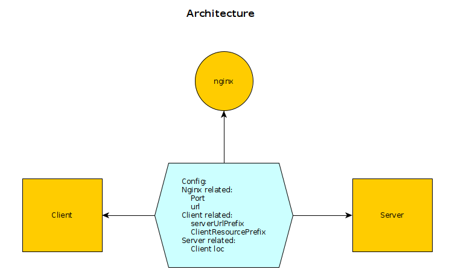

<h1> DIY Webapp</h1>
Gone are the days where every IT guy/girl/person had a specific job like QA, developer, architect etc.  Good riddance, since we are all are creative and want to have fun and indulge in more than we can handle!  Welcome to the "full-stack" developer, whom, once you hire, you can heave a sigh of relief..
 
This article addresses a specific way of developing a web application and should be of interest to the 'full-stack' developer. In today's normal design, a web application follows the same paradigm as client-server application. 
The client handles the 'front-end' user interactions and is mostly concerned with the user interface. The server is the 'back-end' and services requests from the front-end.  One challenge here is how to coordinate the development of both so that they work with each other, and manage the complexities.  

Such complexities include different languages for server(python)/client (javascript), configuration files that are interdependent, setting of middle-ware such as nginix, handling the git repositories for both and more. As a lone-wolf full-stack developer having to do everything, we need some cogent method.

<h2>What if we do this:</h2>

Have a single repository with the server and client code in separate folders. This allows the developer to be able to view the client code/logic while working on the server code and vice-versa. This reduces the complexity of  interfacing  the client and server, reduces bugs and makes it easy to test.  It also has advantages in deployment.  Very often the web application has a small audience and hosting both the server and client in one physical server makes deployment easy. 'Version' mismatch  is either elminated or minimized with the code for both client and server being in the same rept.

Have the server, serve the client at a user request from the browser. The server will also serve client requests. This way the server can control the configuration of the client. Further it opens up an opportunity of centralizing client control, such as limiting the number of clients gracefully, keeping track of resources assigment/usage by each client etc. 
It also reduces the number of 'ports' exposed for internet connections.

<h3>Design concepts:</h3>

The server runs on the backend, and serves one request directly from the user.  This is the invoking of the application from the browser.  The response by the server is to serve the client, which is a SPA (single page application almost always a Javascript application).  The client which runs in the browser, then handles all user interactions and calls the server as necessary to satisfy user requests.  
The are complex components in here - the server, the client, middleware (nginix) and each can be elaborate. Here we concentrate on the glue that binds these together.  This glue is the configuration file.  This is diagrammed below:  

---
| Config Item          | Description                                                                                                                                                     |
|----------------------|-----------------------------------------------------------------------------------------------------------------------------------------------------------------|
| port                 | This is port that the webapp runs on. User requests from the browser are routed to this port by nginx                                                           |
| url                  | This is the url that nginx routes to the webapp running on port                                                                                                 |
| serverUrlPrefix      | This url prefix is used by the client to make requests to the server. (Note: The client runs on the user's browser)                                             |
| ClientResourcePrefix | This prefix is used to send requests to the server to  access resources in the client folder. These are the static resources (images, javascript) of the client |
| client loc           | Location of the client folder. The server serves the index.html from this location, as well the client's static resources                                       |

<h3>Logical:</h3>
a. The server is a normal back end server and has its own set of routes PLUS one route that serves the client.
b. The client is a separate folder in the repo named 'client'. It is a javascript single page App.

<h3>Physical</h3>(in the demo app described later on in this article):
The server is implemented Using a python Sanic webserver, and the client is a Javascript Single Page App using lit-elements.

<h3>Folder Structure:  </h3>

<b>Server folder</b>: Folder</b>: contains the Server and Client folders. This folder can be considered as the git repository.

<h3>Example</h3>: 

<b>Application:</b> Fill up a form
Client Javascript application: Display the form, collect data and send to server
Server Python/Sanic Application: Receive form data
Nginix App: Route user/client requests/responses

<b>Steps to implement the example</b>:
1. Create the config file:
2. Develop the client:
    a. Index.html with placeholder for the config client related parameters
    b. The form page component (use lit element for convenience)
3. Develop the server:
    a. Read config file and use it to modify client index.html
    b. Have a route to serve the client (with modified index.html of step a)
    c, Have a route to receive the form data

The relevant code (config.yml, nginx, server app, client-index.html, form.js).  Of these the config.yml contains the core part of this article. It is read, used and distributed to the client by the server app. In the example, the server app distributes the config to the client, by modifying the index.html. The entries in the config file are also distributed to the nginx config file via 'hardcoding'.

